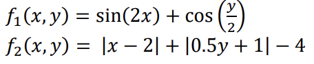

## Beam Search vs Hill Climbing
The performance has increased using beam search, given that it does not get stuck in local maximums by providing k children at each iteration. Although in general, more steps are required for convergence when k
increases. 

We would like to maximize these functions within the range of 0 ≤ 𝑥, 𝑦 ≤ 10. For each part below and each setting, we will report the mean and standard deviation of the number of steps to convergence and of the final value.

# Results

